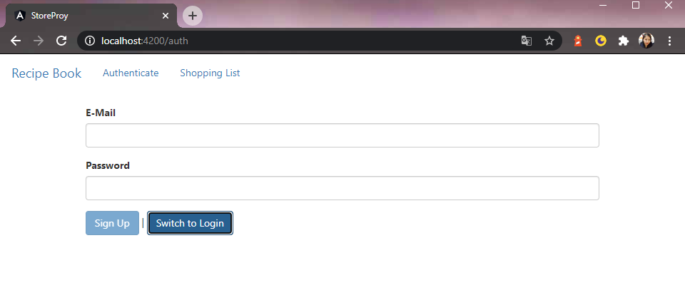
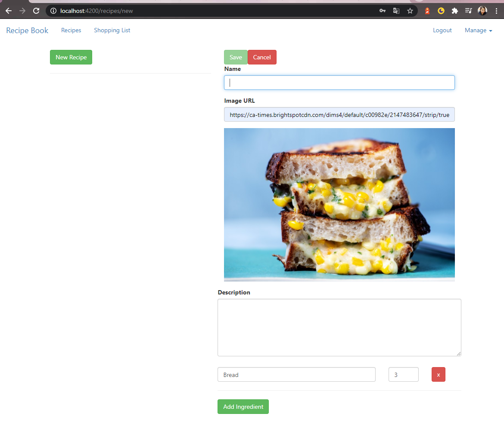
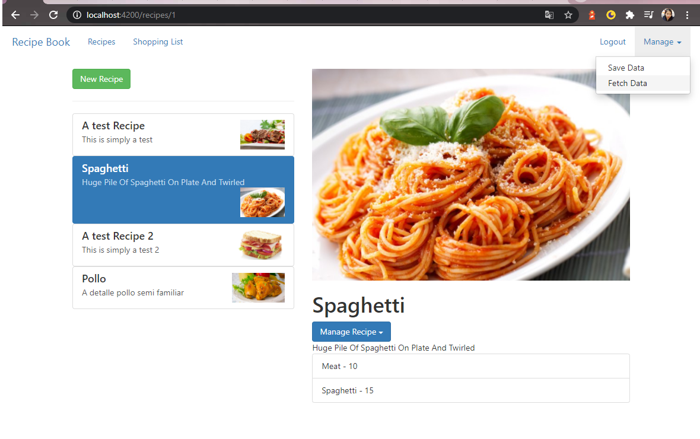
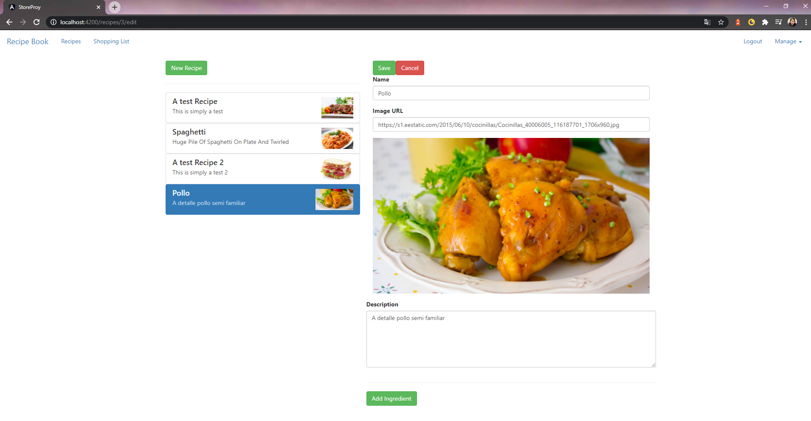

<!-- AUTO-GENERATED-CONTENT:START (STARTER) -->
<h1 align="center">
  Recipes Store
</h1>

This project is recipes store for help you collection your recipes and you have an ingredient guide with preparation.

## 🚀 Quick start 

1.  **Create a new project in Angular.**

    Use the Angular CLI to create a site.

    ```shell
    # create a Angular project cloned from here
    git clone https://github.com/MiriamHuanca/StoreRecipes.git
    ```

1.  **Start dependencies.**

    To install dependencies in the application, on the console type...

    ```shell
    cd StoreRecipes/
    npm install
    ```
    
1.  **Start developing.**

    Navigate into your new site’s directory and start it up.

    ```shell
    ng serve
    ```

    Your site is now running at `http://localhost:4200`!

1.  **Build**
    
    Run ng build to build the project. The build artifacts will be stored in the dist/ directory. Use the --prod flag for a production build.

    ```shell
    ng build --prod
    ```

1.  **Install firebase**

    To install Firebase in the application, on the console type...
    
    ```shell
    npm install -g firebase-tools
    ```

## 🧐 What's inside?

A quick look at the top-level files and directories you'll see in a Angular project.

    .
    ├── node_modules
    ├── src
    ├── .gitignore
    ├── angular.json
    ├── package-lock.json
    ├── package.json
    └── README.md

1.  **`/node_modules`**: This directory contains all of the modules of code that your project depends on (npm packages) are automatically installed.

2.  **`/src`**: This directory will contain all of the code related to what you will see on the front-end of your site (what you see in the browser) such as your site header or a page template. `src` is a convention for “source code”.

3.  **`.gitignore`**: This file tells git which files it should not track / not maintain a version history for.

4. **`package-lock.json`** (See `package.json` below, first). This is an automatically generated file based on the exact versions of your npm dependencies that were installed for your project. **(You won’t change this file directly).**

5. **`package.json`**: A manifest file for Node.js projects, which includes things like metadata (the project’s name, author, etc). This manifest is how npm knows which packages to install for your project.

6. **`README.md`**: A text file containing useful reference information about your project.

## 🎓 Learning

Looking for more guidance? Full documentation for Angular lives [on the website](https://angular.io/). Here are some places to start:

- **To dive straight into code samples, head [to our documentation](https://angular.io/docs/).** In particular, check out the _Guides_, _API Reference_, and _Advanced Tutorials_ sections in the sidebar.

## 💫 Deploy

User: **mairim.acnauh@yahoo.es**

Password: **asdasd**

[](https://ng-store-recipe-book.web.app/)

## An overview to the project

- The first image is login or sign up, but here we have to enter de **e-mail** and **password** to be part of the choise.
  
- The second is when you have to new Recipe, you fill in data and add the ingredients, finally save.
  
- Ther third shows you the value you have saved and your photo.
  
- The last is the result of all recipes who has saved and changes.
  

<!-- AUTO-GENERATED-CONTENT:END -->
